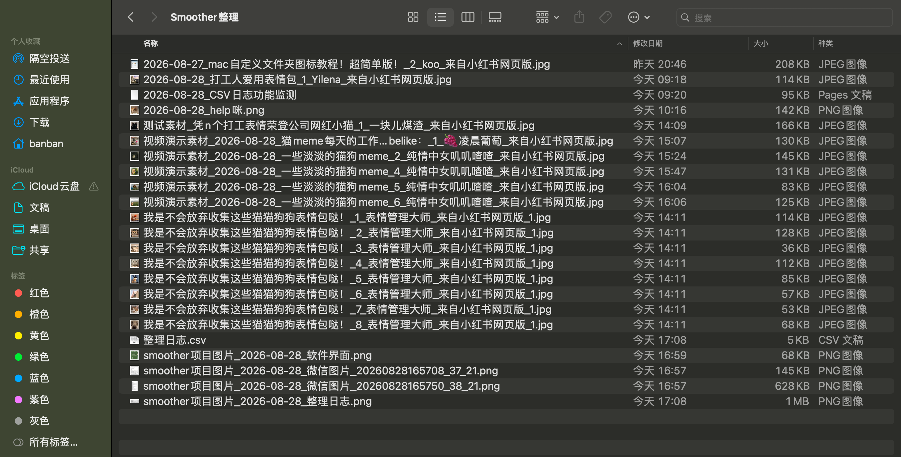
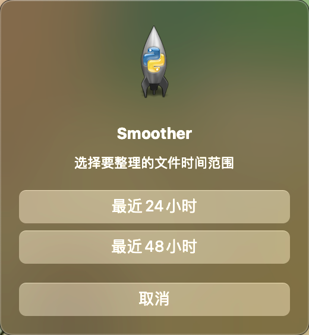
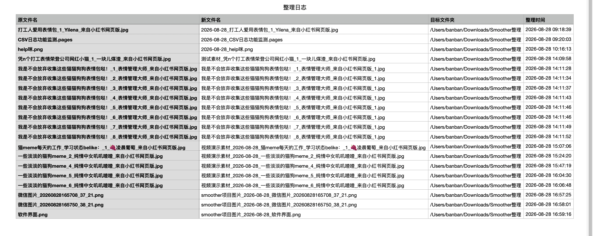
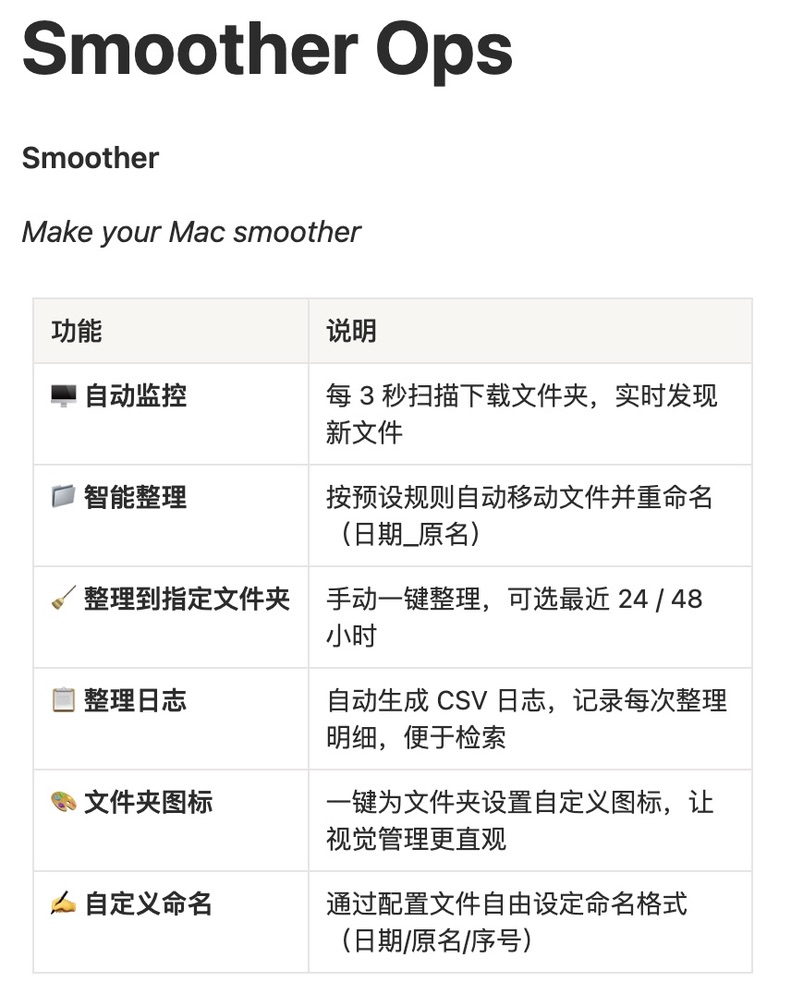
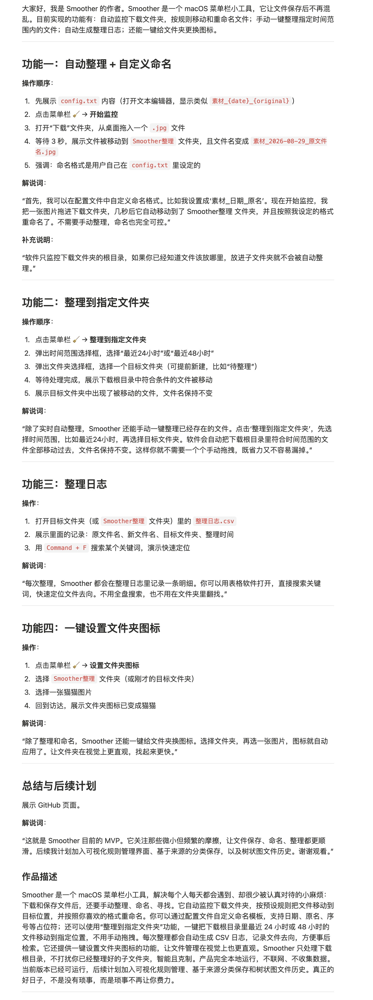

# Smoother

> Make your Mac smoother

**赛道**：软件赛道　|　**命题**：好日子 - Liberlive 特别命题

## 项目背景

Mac 的「下载」文件夹是个持续熵增的地方：每次下载都在往里堆文件，截图、PDF、图片、文档混在一起，几天不清理就乱成一团。市面上的文件管理工具大多做大而全——云同步、标签、AI 分类——却没人解决「刚下载下来那一刻」的微小摩擦：你还得手动把文件拖进对应的文件夹、改名、整理。

Smoother 想做的就是这件小事：盯着下载文件夹，文件一落地就按规则自动归类、改名、记日志。它不取代你的手动整理习惯，只把「下载 → 整理」这段最烦人的重复劳动自动化。本地运行、无需联网、不碰你已整理好的子文件夹。

## 目标用户

- **重度下载用户**：每天产生大量截图、PDF、文档，下载文件夹长期失控
- **隐私敏感用户**：不愿把本地文件交给云端 / 第三方服务处理
- **整理强迫症患者**：希望文件名整齐、归类清晰、有据可查
- **Mac 轻量工具爱好者**：偏好菜单栏常驻、不占 Dock、安静后台运行的小工具

## 核心功能

### 1. 自动监控下载文件夹
后台线程每 3 秒轮询扫描 `~/Downloads` 根目录，发现新文件即触发整理。**只监控根目录、不监控子文件夹**——你手动整理好的目录不会被反复打扰。

### 2. 按规则自动移动并重命名
内置默认规则：`jpg / png / pages / pdf` 文件自动移动到 `~/Downloads/Smoother整理`。匹配到规则的文件会被移动并按模板重命名；不匹配的文件保持原样。规则可在代码中扩展。

### 3. 自定义命名模板
通过同目录下的 `config.txt` 配置命名模板，支持三个占位符：

| 占位符 | 含义 | 示例 |
|---|---|---|
| `{date}` | 整理日期（YYYY-MM-DD） | `2026-08-27` |
| `{original}` | 原文件名（不含扩展名） | `report` |
| `{counter}` | 重名时自动递增的序号，从 1 开始 | `1` → `2` → `3` |

默认模板 `{date}_{original}`。例如 `photo.jpg` → `2026-08-27_photo.jpg`；启用 counter 后遇重名自动 `_1` / `_2`。

### 4. 自动生成整理日志
每次移动成功，在目标文件夹下追加一条 `整理日志.csv` 记录，四列：**原文件名、新文件名、目标文件夹、整理时间**。CSV 不存在时自动建表头，编码 `utf-8-sig`（Excel / Numbers 打开中文不乱码）。

### 5. 一键设置文件夹图标
菜单栏点击「设置文件夹图标」→ 先选目标文件夹、再选 png / jpg / jpeg 图片，通过 `NSWorkspace.setIcon:forFile:options:` 一键应用为该文件夹的自定义图标，成功后弹系统通知。

### 6. 整理到指定文件夹
手动一键把 `~/Downloads` 根目录文件批量搬到任意指定文件夹。点击后先选时间范围（**最近 24 小时 / 48 小时**），再选目标文件夹，只搬符合时间范围的文件，**保留原文件名**，重名自动加 `_1` / `_2`（保留扩展名），同样写入整理日志 CSV。避免误移更早的、你已经处理过的文件。

## 演示视频

[点击观看 Smoother 基础功能演示](videos/Smoother-基础功能演示-软件赛道.mp4)

> 若链接无法打开，演示视频见提交附件或 GitHub Release。

## 技术栈

- **Python 3** + **rumps**：菜单栏常驻应用框架
- **PyObjC / AppKit**：调用 macOS 原生能力（NSOpenPanel 文件选择、NSWorkspace 设置文件夹图标、NSAlert 模态弹窗、系统通知）
- **标准库轮询**：`os.scandir` + `threading` 后台线程每 3 秒扫描，`shutil.move` 移动，`csv` 写日志，`dataclasses` 定义规则
- **不依赖 watchdog**：最初用 watchdog 事件驱动方案，在 Python 3.14 + 当前 macOS 环境下 FSEvents 流创建失败（`Failed creating fsevent stream`），改为标准库轮询，稳定可靠、零外部依赖、文件数据不离开电脑，注重数据安全与用户体验

## 创新点

- **只盯下载根目录，不打扰子文件夹**：你手动整理好的目录永不被反复扫描 / 搬动，自动化与人工整理和平共处
- **完全本地运行，无需联网**：不联网、不上传、不建账号，文件数据不离开电脑，保护隐私
- **本地轮询方案稳定可靠**：不依赖网络与系统事件流，文件数据不离开电脑，注重数据安全与用户体验
- **关注「微小摩擦」，不做大而全**：不堆砌云同步 / AI 分类 / 标签体系，只把「下载 → 整理」这一段最烦人的重复劳动自动化
- **手动整理支持时间范围**：批量整理可选最近 24 / 48 小时，避免误移更早的、已处理过的文件

## 开发过程

1. **方案选型**：最初采用 watchdog 事件驱动方案，期望靠 FSEvents 实时感知下载目录变化。
2. **环境阻碍**：在 Python 3.14 + 当前 macOS 环境下，FSEvents 流创建失败（`Failed creating fsevent stream (Operation not permitted)`），watchdog 后台线程直接崩溃。尝试给终端授权「完全磁盘访问」等方案后仍未稳定，决定**放弃事件驱动、改为人肉轮询**。
3. **MVP 跑通**：改用 `threading` 后台线程 + `os.scandir` 每 3 秒扫描，维护已知文件集合做差集，发现新文件即整理。轮询方案零外部依赖、稳定可靠，反而更符合「本地、隐私、不依赖系统事件」的产品定位。
4. **逐步增强**：在 MVP 上陆续加入自定义命名模板（config.txt + `{counter}`）、CSV 整理日志、一键设置文件夹图标。
5. **手动整理 + 时间范围**：新增「整理到指定文件夹」功能用于一次性批量整理，并加入 24 / 48 小时时间范围选择，避免误移更早文件。

## 团队分工

本项目为**个人独立完成**。产品构思、功能开发、测试、文档与演示视频制作均由作者一人完成。

## 后续计划

- 可视化规则管理界面（免改代码即可增删规则）
- 基于来源网站 / 软件的分类保存
- 树状图文件历史视图
- 文件 / 文件夹说明备注
- 撤回功能（误移可一键还原）
- 按日历日（今天 / 昨天）分类整理

## 运行方式

### 环境准备
```bash
pip3 install rumps pyobjc-framework-Cocoa
```

### 启动
```bash
python3 ~/Desktop/Smoother/smoother.py
```
菜单栏出现 🧹 图标，菜单结构：
```
开始监控
停止监控
───
整理到指定文件夹
───
设置文件夹图标
───
退出
```

### 使用流程
1. 点「开始监控」→ 向 `~/Downloads` 拖入 `jpg/png/pages/pdf` 文件 → 自动搬到 `~/Downloads/Smoother整理` 并按模板改名，终端输出 `[Smoother] 已整理: ...`。
2. 不匹配规则的文件保持原样，输出 `[Smoother] 跳过（无匹配规则）: ...`。
3. 想一次性批量整理 → 点「整理到指定文件夹」→ 选时间范围 → 选目标文件夹。
4. 想给某个文件夹换图标 → 点「设置文件夹图标」→ 选文件夹 → 选图片。

### 自定义
- **命名模板**：编辑 `~/Desktop/Smoother/config.txt`，写入如 `{date}_{original}_{counter}`，重启生效；文件为空或不存在则用默认 `{date}_{original}`。
- **规则**：在 `smoother.py` 的 `self._rules` 中按 `Rule(extensions=[...], destination="...")` 增删。

## 项目截图













---

> 本项目参加 2026 千人蜕变大通科技创造节，GitHub Topic: shenicest-fission
